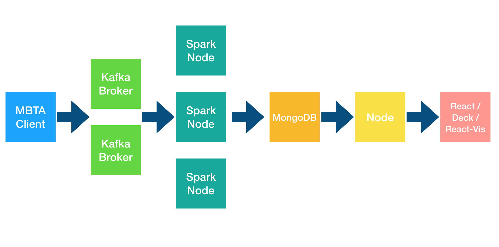
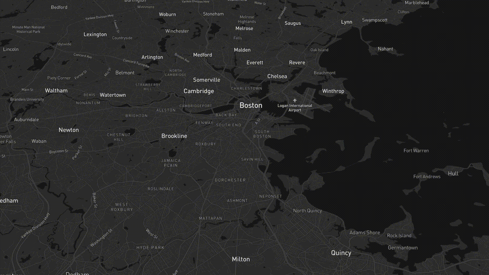
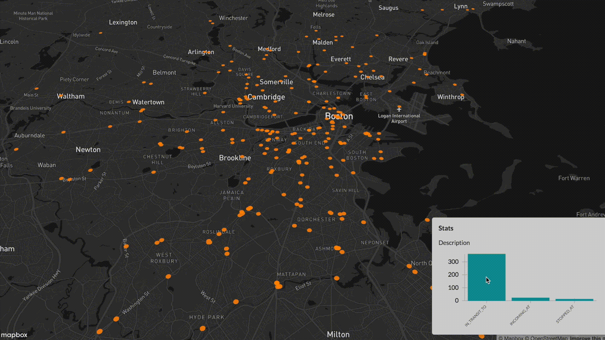

# Real-Time Geospatial Analytics and Visualization
## Introduction
This code is for a data processing pipeline that implements an End-to-End Real-Time Geospatial Analytics and Visualization multi-component full-stack solution.

## Objective

This multi-component full-stack solution was built as a demo, and a show of capabilities of what could be done with modern open-source technologies, especially Apache Spark. The client is a Department of Transportation, and is interested in visualizing real-time locations of buses and taxis, and would like to know if real-time analytics could be computed using the streaming data, instead of going through the traditional analytics / data warehouse process. 

## Technologies 

Apache Spark Structured Streaming, Apache Kafka, MongoDB Change Streams, Node.js, React, Uber's Deck.gl and React-Vis, and using the Massachusetts Bay Transportation Authority's (MBTA) APIs.


## Data Source

In this instance, I chose the MBTA to be the data source, but GTFS-Realtime data sources could be used as well. You can click [here](https://api-v3.mbta.com/) to get an API Access Key, and the service overview and documentation could be found [here](https://www.mbta.com/developers/v3-api).

## Architecture of Data Processing Pipeline 

An architecture diagram would go a long way to explain the data flow in this solution:



## Components

This project has been tested with the following component versions: 
* **Apache Spark:** v2.4.3
* **Apache Kafka:** v2.2.1
* **MongoDB:** v4.0.3
* **Node.js:** v12.2.0
* **React:** v16.8.6
* **Deck.gl:** v7.1.10
* **React-Vis:** v1.11.7


## Testing and Deployment

All components of this project have been developed and tested on a single machine (on my Mac). 

The project has also been successfully deployed on a 5-node cloud landscape: one node for the MBTA client and Kafka, one node for MongoDB and Node.js, and a 3-node Spark / Hadoop cluster.


## Operating Guide

This section has instructions on how to operate this project. 

The assumption here is that all the above components have already been installed and properly configured, and a basic familiarity with all the below components and tools:

First off, we need to start Zookeeper, by typing the following commandline - and by changing paths to the properties file appropriately:


```commandline
zookeeper-server-start /usr/local/etc/kafka/zookeeper.properties 
```

Next, we start Apache Kafka: 

```commandline
kafka-server-start /usr/local/etc/kafka/server.properties
```

The next step would be to start MongoDB with Replica Sets. More can be learned from this nice [online tutorial](https://blog.usejournal.com/using-mongodb-as-realtime-db-with-nodejs-c6f52c266750).

First start the MongoDB daemon: 
```commandline
mongod --port 27017 --replSet rs0
```

Then, use the `mongo` client to initiate the Replica Set:

```commandline
mongo
rs.initiate()
```

The next step would be to submit the Spark job:

```commandline
cd Spark

spark-submit --verbose --master local --driver-memory 2g --executor-memory 1g --packages org.apache.spark:spark-sql-kafka-0-10_2.11:2.4.3,org.mongodb.spark:mongo-spark-connector_2.11:2.4.0 mbta-spark.py
```

Please note the `--master local` flag, which should be replaced with `--master yarn --deploy-mode cluster` when running the Spark job in cluster-mode. This is assuming Yarn as resource manager, please [change appropriately](https://spark.apache.org/docs/latest/running-on-yarn.html).

Next, we start both Node.js, and React Webpack Dev Server in Hot Module Replacement mode:

```commandline
cd Visualization/server
npm run stream
```

```commandline
cd Visualization/client
npm start
```
This will open up the React application in the browser.

The last step is to start the MBTA client, which calls the MBTA API, gets the event stream, and forwards it to Kafka: 

```commandline
python mbta.py
```

## Visualization

The below is a capture of the React visualization client. As you can see, all events, even analytics, are pushed in real-time to the browser. No polling whatsoever takes place. This is visible by watching the buses moving each on their own, and not in batches. The graph showing the type of events received from MBTA is a demo of real-time analytics, computed on data streams by Spark. The below capture playback has been sped 8x times:




Also, Deck.gl is an awesome library that is fully interactive, and that allows a multitude of user actions, such as zooming, rotating, changing pitch and bearing values, etc..


A nice integration is to link interaction on the chart, with the dots on the map, which are the overlaid objects on the Mapbox canvas. When the mouse hovers above a certain bar on the graph, the dots on the map having the same feature will be highlighted and will change color. You can find out a nice tutorial about achieving that [here](http://vis.academy/#/building-a-geospatial-app/6-linking-it-all):





## Future Work

The following changes could be added to the project, some are easily implemented, others need more work:

* Node doesn't serve the HTML/JS files of the React app for now, but code could be easily added to do so
* No security was built-in for communications between components
* Although I planned to appropriately handle DELETE events sent by the MBTA API, and I had a DataFrame for it in the Spark job code, but due to time constraints I didn't manage to finish this. This means that over time, some dots on the map will represent "zombie" buses and transport vehicles.


## License

The contents of this repository are covered under the MIT License.


